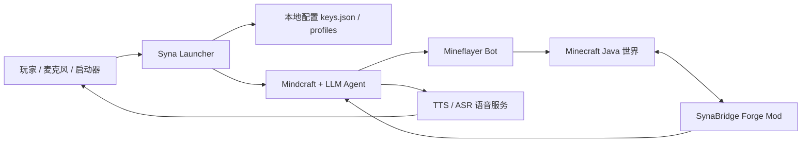

<div align="center">

# Syna MC Bot

### 会听、会说、会进 Minecraft 干活的 AI 伙伴

基于 Mineflayer 的 Minecraft 智能体套件，叠加 LLM 大脑、Forge Mod 身体桥、语音交互、网页控制台和 Windows 启动器。

[项目源码](./mindcraft-develop) · [Forge Mod](./syna_mod) · [开源发布说明](./OPEN_SOURCE_RELEASE.md)

</div>

---

## Syna 是什么

Syna 不是一个只会执行脚本的 Minecraft bot。它更像一个可以被配置、被语音唤起、能在世界里观察和行动的 AI 角色。

这个仓库把两部分合在一起：

- `mindcraft-develop/`：LLM 智能体、Mineflayer 连接、任务系统、语音服务、网页控制台、启动器配置桥。
- `syna_mod/`：Minecraft Forge 侧的 SynaBridge Mod，负责把游戏内更真实的状态、交互和表现暴露给外部智能体。

目标体验是：下载项目，打开 Syna 启动器，填入自己的模型和语音 Key，选择 Minecraft 的 `mods` 文件夹，安装 Syna Mod，然后启动 Syna。

> 当前开源版已经包含启动器源码、配置桥和已构建的 `synabridge-0.1.0.jar`。完整“下载后点一下自动安装全部依赖”的 bootstrap 仍在完善中。

## 核心功能

### LLM 大脑

- 支持多种模型 Provider：OpenAI 兼容接口、DeepSeek、Qwen、Gemini、Claude、Ollama、LM Studio 等。
- 可通过 `profiles/syna.json` 配置人格、模型和行为参数。
- 支持任务驱动、自然语言指令、世界状态读取和动作规划。

### Minecraft 行动层

- 基于 Mineflayer 连接 Minecraft Java 世界。
- 支持跟随、移动、采集、合成、建造、任务执行等动作链路。
- 可对接局域网世界，也可以按原 Mindcraft 方式连接服务器。

### SynaBridge Forge Mod

- 提供更贴近游戏内实体的状态桥接。
- 包含 Syna 相关实体、客户端显示、蓝图/建筑辅助、语音焦点表现等能力。
- 已提供可直接安装的 Mod jar：`syna_mod/built-jars/synabridge-0.1.0.jar`。

### 语音交互

- TTS：让 Syna 可以把文本回复合成为语音。
- ASR：麦克风语音转文本后自动转发给 Syna。
- 启动器内可配置 Volcano 火山语音相关 Key 和参数。

### Windows 启动器

- 图形化填写 Minecraft 地址、端口、模型配置和语音配置。
- 保存 API Key 到本地 `keys.json`，不会提交到 Git。
- 选择 Minecraft/整合包的 `mods` 文件夹并安装 Syna Mod。
- 一键启动 Mindcraft、TTS 和 ASR 服务。

## 和 Mineflayer 有什么不同

Mineflayer 是底层能力，Syna 是面向体验的完整智能体系统。

| 对比项 | Mineflayer | Syna MC Bot |
| --- | --- | --- |
| 定位 | Minecraft Java bot 开发库 | 可配置、可语音交互的 AI 伙伴套件 |
| 使用方式 | 写 JavaScript 调 API | 启动器配置 + LLM 规划 + Bot 执行 |
| 智能层 | 需要开发者自己实现 | 内置 LLM 接入、Profile、任务和对话链路 |
| 游戏表现 | 主要是协议层 bot | 叠加 Forge Mod，提供更真实的游戏内桥接和表现 |
| 语音 | 不内置 | 内置 TTS/ASR 服务入口 |
| 普通用户体验 | 偏开发者工具 | 目标是下载、填 Key、安装 Mod、启动体验 |

一句话：**Mineflayer 负责“能进游戏和执行动作”，Syna 负责“像一个 AI 角色一样理解、说话、规划、配置和交互”。**

## 架构一眼看懂



## 快速开始

### 1. 准备环境

当前版本建议准备：

- Minecraft Java Edition
- Forge 1.20.1 环境或对应整合包
- Node.js 18/20 LTS
- Python 3.10+，用于语音服务
- 至少一个模型 API Key，或本地 Ollama / LM Studio

### 2. 安装依赖

```powershell
cd mindcraft-develop
npm install
```

### 3. 配置 Key

可以用启动器填写，也可以复制示例文件：

```powershell
copy keys.example.json keys.json
```

然后在 `keys.json` 里填入自己的 Key。这个文件已被 `.gitignore` 忽略，不会进入 GitHub。

### 4. 安装 Syna Mod

把这个文件复制到你的 Minecraft/整合包 `mods` 文件夹：

```text
syna_mod/built-jars/synabridge-0.1.0.jar
```

或者使用启动器里的“安装/更新 Syna Mod”。

### 5. 启动

在 Minecraft 中打开一个局域网世界，记下端口，然后启动：

```powershell
cd mindcraft-develop
node main.js
```

如果使用启动器，则在启动器里填写局域网端口，测试连接后启动。

## 仓库结构

```text
syna-mc-bot/
├─ mindcraft-develop/      # LLM 智能体、Mineflayer、网页控制台、启动器、语音服务
├─ syna_mod/               # Forge SynaBridge Mod 源码与已构建 jar
├─ OPEN_SOURCE_RELEASE.md  # 发布清单与隐私文件说明
└─ .gitignore              # 防止 Key、日志、bot 记忆和本机配置被提交
```

## 本地隐私与安全

这些文件是本机私有内容，默认不会提交：

- `mindcraft-develop/keys.json`
- `mindcraft-develop/control_config.json`
- `mindcraft-develop/launcher/launcher_config.json`
- `mindcraft-develop/launcher/voice_config.json`
- `mindcraft-develop/bots/`
- `mindcraft-develop/logs/`
- `mindcraft-develop/node_modules/`

请不要把自己的 API Key、服务器地址、语音 Token、聊天历史和日志截图发到公开 Issue。

## 路线图

- [ ] 启动器内置“安装依赖”按钮，自动执行 Node/npm 依赖安装。
- [ ] 发布 Windows 一键包，减少手动命令。
- [ ] 优化首次配置流程：模型、语音、Minecraft 端口、Mod 安装一条龙。
- [ ] 完善 SynaBridge Mod 的状态感知、建筑辅助和角色表现。
- [ ] 增加更多本地模型预设。

## 致谢

Syna 的底层 Minecraft bot 能力建立在 Mineflayer 生态之上；智能体部分基于 Mindcraft 思路继续扩展。本项目的重点是把这些能力包装成一个更接近“可体验 AI 伙伴”的完整工具链。

---

<div align="center">

**Syna MC Bot：把 Minecraft 变成 AI 可以真正进入的世界。**

</div>
